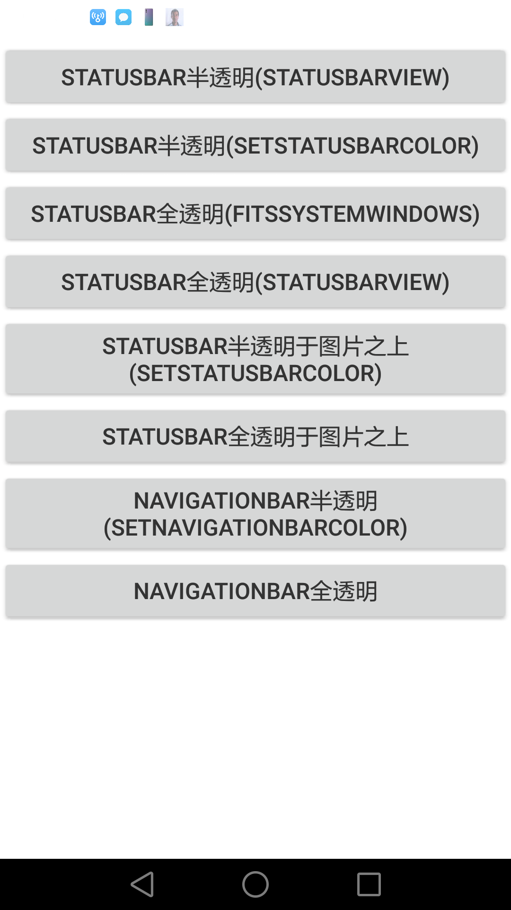
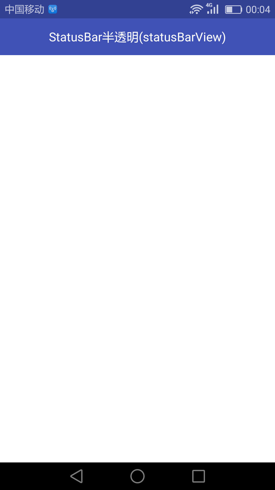
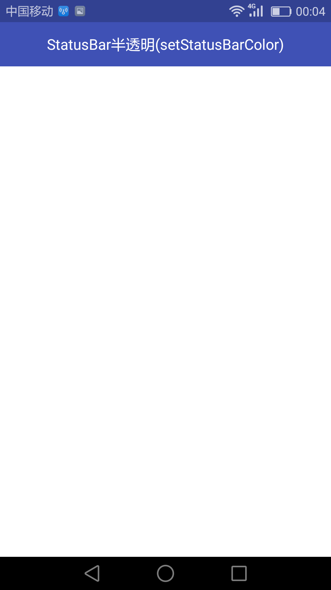
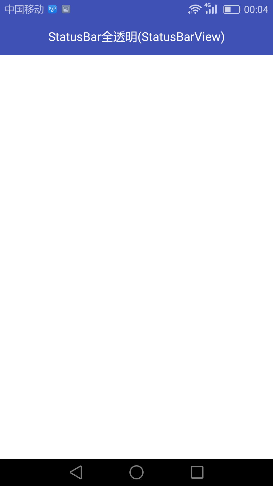
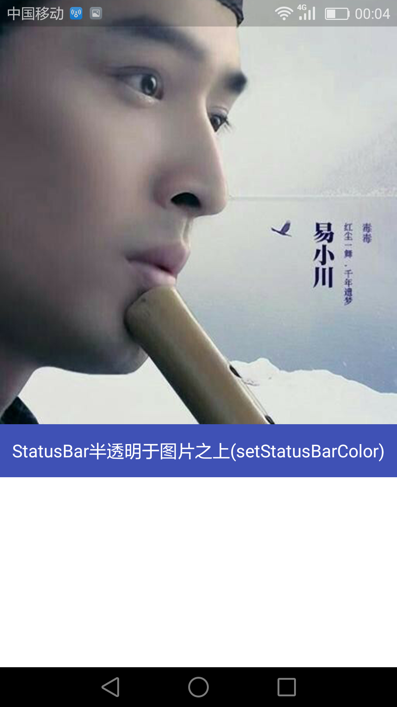
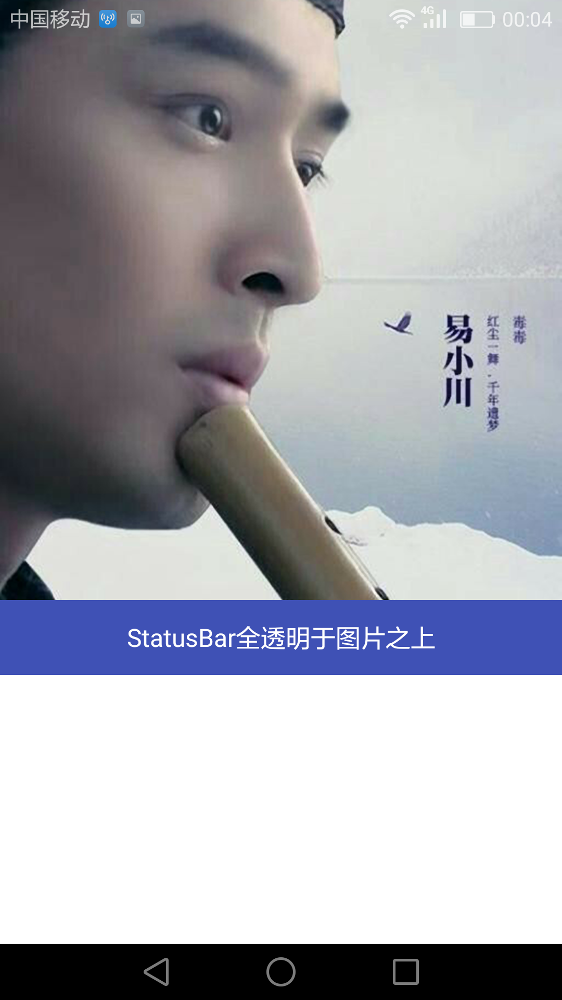
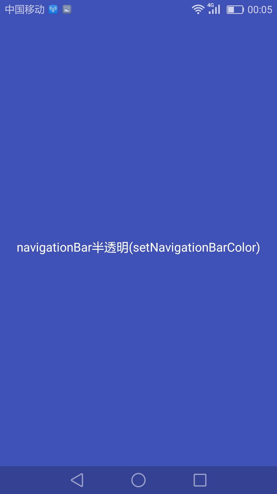
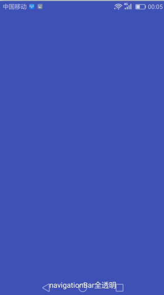

[推荐Android系统源码网站](https://www.androidos.net.cn/)

  微信公众号
  
 
 
[简书](https://www.jianshu.com/u/b8159d455c69)

[APK](https://github.com/AnJiaoDe/StatusNavigationTransparent/blob/master/app/build/outputs/apk/app-debug.apk)


**使用方法**

将libray模块复制到项目中,或者直接在build.gradle中依赖:

```
allprojects {
		repositories {
			
			maven { url 'https://jitpack.io' }
		}
	}
```

```
dependencies {
	        compile 'com.github.AnJiaoDe:StatusNavigationTransparent:V1.1.2'
	}
```

**注意：如果sync报错，是因为和com.android.tools.build:gradle 3.0有关，**
**可以改将compile改为implementation 或者api** 




 **注意：状态栏半透明和全透明只有4.4以上才能实现，5.0以上才能去阴影**
 
  **本文只描述在activity中如何使用，fragment中使用方法类似，可以实现**
 
 **首先创建全局theme**
 
```
<resources>

    <!--&lt;!&ndash; Base application theme. &ndash;&gt;-->
    <style name="AppTheme" parent="Theme.AppCompat.Light.NoActionBar">

        <!--此处可自行根据项目需要设置,和状态栏导航栏透明无关-->
        <item name="colorPrimary">@color/colorPrimary</item>
        <item name="colorPrimaryDark">@color/colorPrimaryDark</item>
        <item name="colorAccent">@color/theme</item>
        <item name="android:windowBackground">@color/white</item>
        <item name="android:windowSoftInputMode">stateAlwaysHidden</item>
        <item name="android:textColor">@color/text_deep</item>
        <item name="android:textSize">@dimen/size_3</item>
        <item name="android:scaleType">centerInside</item>
        <item name="android:launchMode">singleTop</item>
    </style>

</resources>

```

```
<application
        android:allowBackup="true"
        android:icon="@mipmap/ic_launcher"
        android:label="@string/app_name"
        android:supportsRtl="true"
        android:theme="@style/AppTheme">
```
 
 **然后创建BaseActivity实现StatusBar全透明**

```
public abstract class BaseActivity extends AppCompatActivity implements View.OnClickListener {

    @Override
    protected void onCreate(@Nullable Bundle savedInstanceState) {
        super.onCreate(savedInstanceState);

        StatusNavUtils.setStatusBarColor(this,0x00000000);
    }
    public void startAppcompatActivity(Class<?> cls) {
        startActivity(new Intent(this, cls));
    }


}

```

**1. StatusBar半透明**


**1.1 StatusBar半透明用StatusBarView实现(4.4以上有效)**





```
<?xml version="1.0" encoding="utf-8"?>
<LinearLayout xmlns:android="http://schemas.android.com/apk/res/android"
    xmlns:tools="http://schemas.android.com/tools"
    android:layout_width="match_parent"
    android:layout_height="match_parent"
    android:background="@color/colorPrimary"
    android:orientation="vertical">

    <com.cy.translucentparent.StatusBarView
        android:layout_width="match_parent"
        android:layout_height="wrap_content"
        android:background="#33000000" />

    <RelativeLayout
        android:layout_width="match_parent"
        android:layout_height="48dp"
        android:background="@color/colorPrimary">

        <TextView
            android:layout_width="match_parent"
            android:layout_height="match_parent"
            android:gravity="center"
            android:text="StatusBar半透明(statusBarView)"
            android:textColor="#ffffff" />
    </RelativeLayout>

    <LinearLayout
        android:layout_width="match_parent"
        android:layout_height="match_parent"
        android:background="@color/white"
        android:orientation="vertical"></LinearLayout>
</LinearLayout>

```

```
public class Status1Activity extends BaseActivity {

    @Override
    protected void onCreate(Bundle savedInstanceState) {
        super.onCreate(savedInstanceState);
        setContentView(R.layout.activity_trans_status_bar);
    }

    @Override
    public void onClick(View v) {

    }
}

```

**1.2 StatusBar半透明用setStatusBarColor实现(5.0以上有效)**



```
<?xml version="1.0" encoding="utf-8"?>
<LinearLayout xmlns:android="http://schemas.android.com/apk/res/android"
    xmlns:tools="http://schemas.android.com/tools"
    android:layout_width="match_parent"
    android:layout_height="match_parent"
    android:background="@color/colorPrimary"
    style="@style/transparent_statusbar_fit"
    android:orientation="vertical">


    <RelativeLayout
        android:layout_width="match_parent"
        android:layout_height="48dp"
        android:background="@color/colorPrimary">

        <TextView
            android:layout_width="match_parent"
            android:layout_height="match_parent"
            android:gravity="center"
            android:text="StatusBar半透明(setStatusBarColor)"
            android:textColor="#ffffff" />
    </RelativeLayout>

    <LinearLayout
        android:layout_width="match_parent"
        android:layout_height="match_parent"
        android:background="@color/white"
        android:orientation="vertical"></LinearLayout>
</LinearLayout>

```

```
public class Status2Activity extends BaseActivity {

    @Override
    protected void onCreate(Bundle savedInstanceState) {
        super.onCreate(savedInstanceState);
        setContentView(R.layout.activity_status2);
        StatusNavUtils.setStatusBarColor(this,0x33000000);
    }


    @Override
    public void onClick(View v) {

    }
}

```

**2. StatusBar全透明**


**2.1 StatusBar全透明用fitSystemWindows实现(4.4以上有效)**


```
<?xml version="1.0" encoding="utf-8"?>
<LinearLayout xmlns:android="http://schemas.android.com/apk/res/android"
    xmlns:tools="http://schemas.android.com/tools"
    android:layout_width="match_parent"
    android:layout_height="match_parent"
    style="@style/transparent_statusbar_fit"
    android:background="@color/colorPrimary"
    android:orientation="vertical">


    <RelativeLayout
        android:layout_width="match_parent"
        android:layout_height="48dp"
        android:background="@color/colorPrimary">

        <TextView
            android:layout_width="match_parent"
            android:layout_height="match_parent"
            android:gravity="center"
            android:text="StatusBar全透明(fitsystemwindows)"
            android:textColor="#ffffff" />
    </RelativeLayout>

    <LinearLayout
        android:layout_width="match_parent"
        android:layout_height="match_parent"
        android:background="@color/white"
        android:orientation="vertical"></LinearLayout>
</LinearLayout>

```

```
public class Status3Activity extends BaseActivity {

    @Override
    protected void onCreate(Bundle savedInstanceState) {
        super.onCreate(savedInstanceState);
        setContentView(R.layout.activity_status3);
    }

    @Override
    public void onClick(View v) {

    }
}

```

**2.2 StatusBar全透明用StatusBarView实现(4.4以上有效)**



```
<?xml version="1.0" encoding="utf-8"?>
<LinearLayout xmlns:android="http://schemas.android.com/apk/res/android"
    xmlns:tools="http://schemas.android.com/tools"
    android:layout_width="match_parent"
    android:layout_height="match_parent"
    android:background="@color/colorPrimary"
    android:orientation="vertical">

    <com.cy.translucentparent.StatusBarView
        android:layout_width="match_parent"
        android:layout_height="wrap_content"
        android:background="#00000000" />

    <RelativeLayout
        android:layout_width="match_parent"
        android:layout_height="48dp"
        android:background="@color/colorPrimary">

        <TextView
            android:layout_width="match_parent"
            android:layout_height="match_parent"
            android:gravity="center"
            android:text="StatusBar全透明(StatusBarView)"
            android:textColor="#ffffff" />
    </RelativeLayout>

    <LinearLayout
        android:layout_width="match_parent"
        android:layout_height="match_parent"
        android:background="@color/white"
        android:orientation="vertical"></LinearLayout>
</LinearLayout>

```

```
public class Status4Activity extends BaseActivity {

    @Override
    protected void onCreate(Bundle savedInstanceState) {
        super.onCreate(savedInstanceState);
        setContentView(R.layout.activity_status4);
    }

    @Override
    public void onClick(View v) {

    }
}

```

**3. StatusBar透明于图片之上**


**3.1 StatusBar半透明于图片之上用setStatusBarColor实现(5.0以上有效)**



```
<?xml version="1.0" encoding="utf-8"?>
<LinearLayout xmlns:android="http://schemas.android.com/apk/res/android"
    xmlns:tools="http://schemas.android.com/tools"
    android:layout_width="match_parent"
    android:layout_height="match_parent"
    android:background="@color/colorPrimary"
    android:orientation="vertical">

    <ImageView
        android:layout_width="match_parent"
        android:layout_height="wrap_content"
        android:scaleType="centerCrop"
        android:src="@drawable/huge" />

    <RelativeLayout
        android:layout_width="match_parent"
        android:layout_height="48dp"
        android:background="@color/colorPrimary">

        <TextView
            android:layout_width="match_parent"
            android:layout_height="match_parent"
            android:gravity="center"
            android:text="StatusBar半透明于图片之上(setStatusBarColor)"
            android:textColor="#ffffff" />
    </RelativeLayout>

    <LinearLayout
        android:layout_width="match_parent"
        android:layout_height="match_parent"
        android:background="@color/white"
        android:orientation="vertical"></LinearLayout>
</LinearLayout>

```

```
public class Status5Activity extends BaseActivity {

    @Override
    protected void onCreate(Bundle savedInstanceState) {
        super.onCreate(savedInstanceState);
        setContentView(R.layout.activity_status5);

        StatusNavUtils.setStatusBarColor(this,0x33000000);
    }

    @Override
    public void onClick(View v) {

    }
}

```

**3.2 StatusBar全透明于图片之上(4.4以上有效)**



```
<?xml version="1.0" encoding="utf-8"?>
<LinearLayout xmlns:android="http://schemas.android.com/apk/res/android"
    xmlns:tools="http://schemas.android.com/tools"
    android:layout_width="match_parent"
    android:layout_height="match_parent"
    android:background="@color/colorPrimary"
    android:orientation="vertical">

    <ImageView
        android:layout_width="match_parent"
        android:layout_height="wrap_content"
        android:scaleType="centerCrop"
        android:src="@drawable/huge" />

    <RelativeLayout
        android:layout_width="match_parent"
        android:layout_height="48dp"
        android:background="@color/colorPrimary">

        <TextView
            android:layout_width="match_parent"
            android:layout_height="match_parent"
            android:gravity="center"
            android:text="StatusBar全透明于图片之上"
            android:textColor="#ffffff" />
    </RelativeLayout>

    <LinearLayout
        android:layout_width="match_parent"
        android:layout_height="match_parent"
        android:background="@color/white"
        android:orientation="vertical"></LinearLayout>
</LinearLayout>

```

```
public class Status6Activity extends BaseActivity {

    @Override
    protected void onCreate(Bundle savedInstanceState) {
        super.onCreate(savedInstanceState);
        setContentView(R.layout.activity_status6);
    }

    @Override
    public void onClick(View v) {

    }
}

```

**3. NavigationBar透明**


**3.1 NavigationBar半透明用setNavigationBarColor实现(5.0以上有效)**



```
<?xml version="1.0" encoding="utf-8"?>
<RelativeLayout xmlns:android="http://schemas.android.com/apk/res/android"
xmlns:tools="http://schemas.android.com/tools"
android:id="@+id/activity_status7"
android:layout_width="match_parent"
android:layout_height="match_parent"
android:background="@color/colorPrimary">

<TextView
    android:layout_width="match_parent"
    android:layout_height="match_parent"
    android:gravity="center"
    android:text="navigationBar半透明(setNavigationBarColor)"
    android:textColor="@color/white" />
</RelativeLayout>

```

```
public class Navigation1Activity extends BaseActivity {

    @Override
    protected void onCreate(Bundle savedInstanceState) {
        super.onCreate(savedInstanceState);
        setContentView(R.layout.activity_status7);

        StatusNavUtils.setNavigationBarColor(this,0x33000000);
    }

    @Override
    public void onClick(View v) {

    }
}

```

**3.2 NavigationBar全透明(4.4以上有效)**



```
<?xml version="1.0" encoding="utf-8"?>
<RelativeLayout xmlns:android="http://schemas.android.com/apk/res/android"
    xmlns:tools="http://schemas.android.com/tools"
    android:id="@+id/activity_status7"
    android:layout_width="match_parent"
    android:layout_height="match_parent"
    android:background="@color/colorPrimary">

    <TextView
        android:layout_width="match_parent"
        android:layout_height="48dp"
        android:gravity="center"
        android:layout_alignParentBottom="true"
        android:text="navigationBar全透明"
        android:textColor="@color/white" />
</RelativeLayout>

```

```
public class Navigation2Activity extends BaseActivity {

    @Override
    protected void onCreate(Bundle savedInstanceState) {
        super.onCreate(savedInstanceState);
        setContentView(R.layout.activity_navigation2);

        StatusNavUtils.setNavigationBarColor(this,0x00000000);

    }

    @Override
    public void onClick(View v) {

    }
}

```
 
 

 参考：[Android 屏幕适配](https://blog.csdn.net/confusing_awakening/article/category/6890743)
 
 
  **源码：**
**transparent_statusbar_fit**
```
    <style name="transparent_statusbar_fit">
        <item name="android:fitsSystemWindows">true</item>
        <item name="android:clipToPadding">false</item>
    </style>
```

**StatusNavUtils**
```

public class StatusNavUtils {


    /**
     * 状态栏透明去阴影（5.0以上）
     *
     * @param activity
     * @param color
     */
    public static void setStatusBarColor(Activity activity, int color) {
        Window window = activity.getWindow();

        if (Build.VERSION.SDK_INT >= Build.VERSION_CODES.LOLLIPOP) {
            window.clearFlags(WindowManager.LayoutParams.FLAG_TRANSLUCENT_STATUS | WindowManager.LayoutParams.FLAG_TRANSLUCENT_NAVIGATION);
            window.getDecorView().setSystemUiVisibility(View.SYSTEM_UI_FLAG_LAYOUT_FULLSCREEN | View.SYSTEM_UI_FLAG_LAYOUT_STABLE);
            window.addFlags(WindowManager.LayoutParams.FLAG_DRAWS_SYSTEM_BAR_BACKGROUNDS);
            window.setStatusBarColor(color);
            return;
        }
        if (Build.VERSION.SDK_INT >= Build.VERSION_CODES.KITKAT) {
            window.addFlags(WindowManager.LayoutParams.FLAG_TRANSLUCENT_STATUS);

        }

    }

    /**
     * 导航栏全透明去阴影（5.0以上）
     *
     * @param activity
     * @param color
     */

    public static void setNavigationBarColor(Activity activity, int color) {
        Window window = activity.getWindow();

        if (Build.VERSION.SDK_INT >= Build.VERSION_CODES.LOLLIPOP) {
            window.clearFlags(WindowManager.LayoutParams.FLAG_TRANSLUCENT_STATUS | WindowManager.LayoutParams.FLAG_TRANSLUCENT_NAVIGATION);
            window.getDecorView().setSystemUiVisibility(View.SYSTEM_UI_FLAG_LAYOUT_FULLSCREEN | View.SYSTEM_UI_FLAG_LAYOUT_HIDE_NAVIGATION | View.SYSTEM_UI_FLAG_LAYOUT_STABLE);
            window.addFlags(WindowManager.LayoutParams.FLAG_DRAWS_SYSTEM_BAR_BACKGROUNDS);
            window.setNavigationBarColor(color);
            return;
        }
        if (Build.VERSION.SDK_INT >= Build.VERSION_CODES.KITKAT) {
            window.addFlags(WindowManager.LayoutParams.FLAG_TRANSLUCENT_NAVIGATION);

        }
    }

    /**
     * 状态栏、导航栏全透明去阴影（5.0以上）
     *
     * @param activity
     * @param color_status
     * @param color_nav
     */
    public static void setStatusNavBarColor(Activity activity, int color_status, int color_nav) {
        Window window = activity.getWindow();

        if (Build.VERSION.SDK_INT >= Build.VERSION_CODES.LOLLIPOP) {
            window.clearFlags(WindowManager.LayoutParams.FLAG_TRANSLUCENT_STATUS | WindowManager.LayoutParams.FLAG_TRANSLUCENT_NAVIGATION);
            window.getDecorView().setSystemUiVisibility(View.SYSTEM_UI_FLAG_LAYOUT_FULLSCREEN | View.SYSTEM_UI_FLAG_LAYOUT_HIDE_NAVIGATION | View.SYSTEM_UI_FLAG_LAYOUT_STABLE);
            window.addFlags(WindowManager.LayoutParams.FLAG_DRAWS_SYSTEM_BAR_BACKGROUNDS);

            window.setStatusBarColor(color_status);

            window.setNavigationBarColor(color_nav);
            return;
        }
        if (Build.VERSION.SDK_INT >= Build.VERSION_CODES.KITKAT) {
            window.addFlags(WindowManager.LayoutParams.FLAG_TRANSLUCENT_STATUS);

            window.addFlags(WindowManager.LayoutParams.FLAG_TRANSLUCENT_NAVIGATION);

        }
    }


}

```

**StatusBarView**

```


public class StatusBarView extends View {
    private Context context;
    public StatusBarView(Context context) {
        this(context,null);
    }

    public StatusBarView(Context context, AttributeSet attrs) {
        super(context, attrs);
        this.context=context;

    }

    @Override
    protected void onMeasure(int widthMeasureSpec, int heightMeasureSpec) {

        super.onMeasure(widthMeasureSpec, MeasureSpec.makeMeasureSpec(ScreenUtils.getStatusBarHeight(context), MeasureSpec.EXACTLY));
    }
}

```

**ScreenUtils**

```


public class ScreenUtils {

    public static int getStatusBarHeight(Context context) {
        Resources resources = context.getResources();
        int resourceId = resources.getIdentifier("status_bar_height", "dimen", "android");
        return resources.getDimensionPixelSize(resourceId);
    }

    public static int getNavigationBarHeight(Context context) {
        Resources resources = context.getResources();
        int resourceId = resources.getIdentifier("navigation_bar_height", "dimen", "android");
        return resources.getDimensionPixelSize(resourceId);
    }

    public static int getScreenWidth(Context context) {
        DisplayMetrics displayMetrics = new DisplayMetrics();
        WindowManager wm = (WindowManager) context
                .getSystemService(Context.WINDOW_SERVICE);

        wm.getDefaultDisplay().getMetrics(displayMetrics);
        return displayMetrics.widthPixels;
    }

    public static int getScreenHeight(Context context) {
        DisplayMetrics displayMetrics = new DisplayMetrics();
        WindowManager wm = (WindowManager) context
                .getSystemService(Context.WINDOW_SERVICE);

        wm.getDefaultDisplay().getMetrics(displayMetrics);
        return displayMetrics.heightPixels;
    }

    /**
     * 将px值转换为dip或dp值，保证尺寸大小不变
     *
     * @param pxValue
     * @param scale   （DisplayMetrics类中属性density）
     * @return
     */
    public static int px2dp(Context context, float pxValue) {
        final float scale = context.getResources().getDisplayMetrics().density;
        return (int) (pxValue / scale + 0.5f);
    }

    /**
     * 将dip或dp值转换为px值，保证尺寸大小不变
     *
     * @param dipValue
     * @param scale    （DisplayMetrics类中属性density）
     * @return
     */
    public static int dpInt2px(Context context, int dipValue) {
        final float scale = context.getResources().getDisplayMetrics().density;
        return (int) (dipValue * scale + 0.5f);
    }

    public static int dp2px(Context context, int dimen_resID) {
        final float scale = context.getResources().getDisplayMetrics().density;
        return (int) (context.getResources().getDimension(dimen_resID) * scale + 0.5f);
    }

    /**
     * 将px值转换为sp值，保证文字大小不变
     *
     * @param pxValue
     * @param fontScale （DisplayMetrics类中属性scaledDensity）
     * @return
     */
    public static int px2sp(Context context, float pxValue) {
        final float fontScale = context.getResources().getDisplayMetrics().scaledDensity;
        return (int) (pxValue / fontScale + 0.5f);
    }

    /**
     * 将sp值转换为px值，保证文字大小不变
     *
     * @param spValue
     * @param fontScale （DisplayMetrics类中属性scaledDensity）
     * @return
     */
    public static int sp2px(Context context, float spValue) {
        final float fontScale = context.getResources().getDisplayMetrics().scaledDensity;
        return (int) (spValue * fontScale + 0.5f);
    }

    /**
     * 计算指定的 View 在屏幕中的坐标。
     */
    public static RectF calcViewScreenLocation(View view) {
        int[] location = new int[2];
        // 获取控件在屏幕中的位置，返回的数组分别为控件左顶点的 x、y 的值
        view.getLocationOnScreen(location);
        return new RectF(location[0], location[1], location[0] + view.getWidth(),
                location[1] + view.getHeight());
    }

    /**
     * 判断触摸点是否在控件内
     */
    public static boolean isInViewRange(View view, MotionEvent event) {

        // MotionEvent event;
        // event.getX(); 获取相对于控件自身左上角的 x 坐标值
        // event.getY(); 获取相对于控件自身左上角的 y 坐标值
        float x = event.getRawX(); // 获取相对于屏幕左上角的 x 坐标值
        float y = event.getRawY(); // 获取相对于屏幕左上角的 y 坐标值

        // View view;
        RectF rect = calcViewScreenLocation(view);
        return rect.contains(x, y);
    }
}

```

**更新日志**
 
 *V1.1.1*
  - Android屏幕适配之状态栏导航栏半透明、全透明（5.0以上去阴影），方法多样
  
  

**License**

 Copyright [AnJiaoDe] [name of copyright owner]

   Licensed under the Apache License, Version 2.0 (the "License");
   you may not use this file except in compliance with the License.
   You may obtain a copy of the License at

       http://www.apache.org/licenses/LICENSE-2.0

   Unless required by applicable law or agreed to in writing, software
   distributed under the License is distributed on an "AS IS" BASIS,
   WITHOUT WARRANTIES OR CONDITIONS OF ANY KIND, either express or implied.
   See the License for the specific language governing permissions and
   limitations under the License.

 
 

 [GitHub](https://github.com/AnJiaoDe)

关注专题[Android开发常用开源库](https://www.jianshu.com/c/3ff4b3951dc5)

[简书](https://www.jianshu.com/u/b8159d455c69)

 微信公众号
 

QQ群


